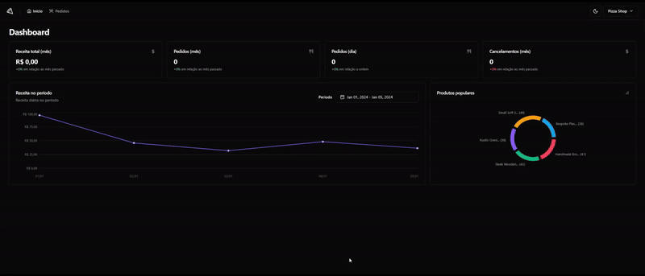

<h1 align="center">
 Pizza Shop
</h1>

<p align="center">
 Pizza Shop é uma aplicação para simplificar a gestão do seu restaurante dentro do aplicativo de delivery. Este dashboard foi desenvolvido com o intuito de proporcionar aos lojistas uma visão abrangente e intuitiva das métricas do seu estabelecimento, promovendo uma tomada de decisão mais informada e eficiente.
</p>

<p align="center">
  <a href="#como-executar">ℹ️ Como Executar?</a>&nbsp;&nbsp;&nbsp;|&nbsp;&nbsp;&nbsp;
  <a href="#web">💻 Web</a>&nbsp;&nbsp;&nbsp;|&nbsp;&nbsp;&nbsp;
  <a href="#tecnologias">🚀 Tecnologias</a>&nbsp;&nbsp;&nbsp;
</p>

---

# Como Executar?

> Clone o Repositório:

Node version 20.10.0

Clone

```bash
git clone https://github.com/JonatanPaes/pizza-shop.git
```

Para executar o projeto

```bash
cd pizzashop-web
```

Instale as dependências do projeto

```bash
npm install
```


# Web
Para executar o projeto

```sh
# Executar a aplicação
npm run dev
```

<p align="center">
  
</p>

# Tecnologias
- [React](https://react.dev/)
- [ViteJS](https://vitejs.dev/)
- [TypeScript](https://github.com/microsoft/TypeScript)
- [Shadcn ui](https://ui.shadcn.com/)
- [React Router](https://reactrouter.com/en/main)
- [React Helmet](https://github.com/staylor/react-helmet-async#readme)
- [React Hook Form](https://react-hook-form.com/)
- [Zod](https://zod.dev/)
- [Sonner](https://sonner.emilkowal.ski/)
- [Recharts](https://recharts.org/en-US/)
- [Axios](https://axios-http.com/)
- [React Query](https://tanstack.com/query/latest)
- [Date-fns](https://date-fns.org/)
- [Vitest](https://vitest.dev/)
- [Testing Library](https://testing-library.com/)
- [Happy Dom](https://github.com/capricorn86/happy-dom)
- [MSW](https://mswjs.io/)
- [Playwright](https://playwright.dev/)
